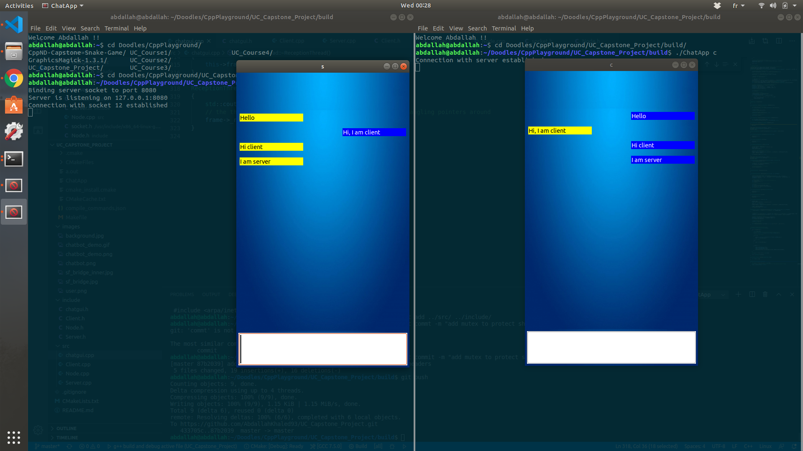

# UC_Capstone_Project
Udacity final project Option 1 (sipmle application for network protocol).
Multithreaded simple chat app using UNIX sockets based on wxWidgets. Two instances of the program are created and messages are exchanged between the two instances in a fullcast communication channel

## Dependencies for Running Locally
* cmake >= 3.11
  * All OSes: [click here for installation instructions](https://cmake.org/install/)
* make >= 4.1 (Linux, Mac), 3.81 (Windows)
  * Linux: make is installed by default on most Linux distros
  * Mac: [install Xcode command line tools to get make](https://developer.apple.com/xcode/features/)
  * Windows: [Click here for installation instructions](http://gnuwin32.sourceforge.net/packages/make.htm)
* gcc/g++ >= 5.4
  * Linux: gcc / g++ is installed by default on most Linux distros
  * Mac: same deal as make - [install Xcode command line tools](https://developer.apple.com/xcode/features/)
  * Windows: recommend using [MinGW](http://www.mingw.org/)
* wxWidgets >= 3.0
  * Linux: `sudo apt-get install libwxgtk3.0-dev libwxgtk3.0-0v5-dbg`
  * Mac: There is a [homebrew installation available](https://formulae.brew.sh/formula/wxmac).
  * Installation instructions can be found [here](https://wiki.wxwidgets.org/Install). Some version numbers may need to be changed in instructions to install v3.0 or greater.

## Basic Build Instructions

1. Clone this repo.
2. Make a build directory in the top level directory: `mkdir build && cd build`
3. Compile: `cmake .. && make`
4. Run it as a server first : `./ChatBot s`.
5. Run it as a client : `./ChatBot c`.

## Rubric Points
### Loops, Functions, I/O
-The project demonstrates an understanding of C++ functions and control structures.
-The project reads data from a file and process the data, or the program writes data to a file. This is acheived by writing to socket file descriptors
-The project accepts user input and processes the input. This is acheived by waiting for the user to enter the message to be sent to other node.

### Object Oriented Programming
-The project uses Object Oriented Programming techniques.
-Classes use appropriate access specifiers for class members.
-Classes abstract implementation details from their interfaces.
-Classes encapsulate behavior.
-Classes follow an appropriate inheritance hierarchy.
-Derived class functions override virtual base class functions. Please refer to send and receive message in both classes Server and Client

### Memory Management
-The project makes use of references in function declarations. the receive message function (return by reference) and
the ChatBotFrame constructor takes a unique pointer by reference
-The project uses destructors appropriately. Please refer to chatgui.cpp ~ReceptionThread()
-The project uses move semantics to move data, instead of copying it, where possible.
-The project uses smart pointers instead of raw pointers. Please refer to _chatNode unique pointer

### Concurrency
-The project uses multithreading. It uses wx threads.
-A mutex or lock is used in the project.
