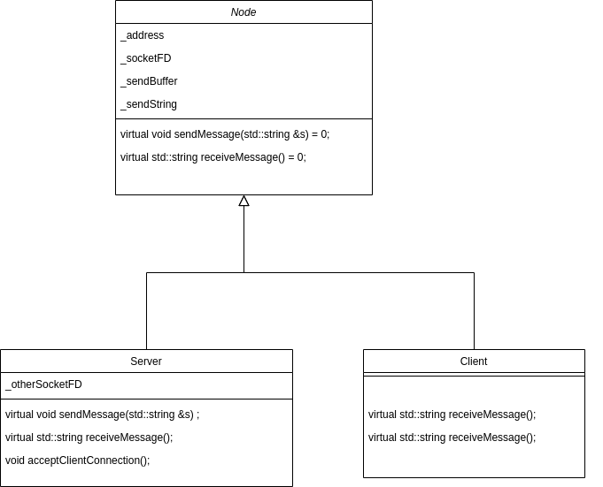

# UC_Capstone_Project
Udacity final project Option 1 (sipmle application for network protocol).
Multithreaded simple chat app using UNIX sockets based on wxWidgets. Two instances of the program are created and messages are exchanged between the two instances in a fullcast communication channel

## Dependencies for Running Locally
* cmake >= 3.11
  * All OSes: [click here for installation instructions](https://cmake.org/install/)
* make >= 4.1 (Linux, Mac), 3.81 (Windows)
  * Linux: make is installed by default on most Linux distros
  * Mac: [install Xcode command line tools to get make](https://developer.apple.com/xcode/features/)
  * Windows: [Click here for installation instructions](http://gnuwin32.sourceforge.net/packages/make.htm)
* gcc/g++ >= 5.4
  * Linux: gcc / g++ is installed by default on most Linux distros
  * Mac: same deal as make - [install Xcode command line tools](https://developer.apple.com/xcode/features/)
  * Windows: recommend using [MinGW](http://www.mingw.org/)
* wxWidgets >= 3.0
  * Linux: `sudo apt-get install libwxgtk3.0-dev libwxgtk3.0-0v5-dbg`
  * Mac: There is a [homebrew installation available](https://formulae.brew.sh/formula/wxmac).
  * Installation instructions can be found [here](https://wiki.wxwidgets.org/Install). Some version numbers may need to be changed in instructions to install v3.0 or greater.

## Basic Build Instructions

1. Clone this repo.
2. Make a build directory in the top level directory: `mkdir build && cd build`
3. Compile: `cmake .. && make`
4. Run it as a server first : `./ChatBot s`.
5. Run it as a client : `./ChatBot c`.

## Rubric Points
### Loops, Functions, I/O
-The project demonstrates an understanding of C++ functions and control structures. **There is a while loop in wxThread::ExitCode ReceptionThread::Entry(), if conditions in Node, Client and Server member functions. Each function in all the files do a specific job**.

-The project reads data from a file and process the data, or the program writes data to a file. This is acheived by writing to socket file descriptors. **Please refer to functions sendMessage and receiveMessage in Client and Server classes**.

-The project accepts user input and processes the input. This is acheived by waiting for the user to enter the message to be sent to other node. **Please check the function OnEnter in chatgui.cpp file**.

### Object Oriented Programming
-The project uses Object Oriented Programming techniques. **Please check Node, Server and Client**.
-Classes use appropriate access specifiers for class members. **Please refer to files : Node.h, Server.h, Client.h and chatgui.h**.
-Classes abstract implementation details from their interfaces. The constructors and the member functions of the Client and Server classes hides the connection detaits from the chatgui. The chatgui only calls the constructor and functions to establish, send and receive function with any prior interactions with sockets. **Please refer to Client.cpp and Server.cpp. Also refer to bool ChatBotApp::OnInit(), 
void ChatBotFrame::OnEnter(wxCommandEvent &WXUNUSED(event)) and wxThread::ExitCode ReceptionThread::Entry()**.

-Classes encapsulate behavior. **In ChatBotApp::OnInit(), function calls acceptClientConnections and connectToServer modifies the state
of the node object without direct access to variables**.

-Classes follow an appropriate inheritance hierarchy. **Classes Server and Client are inherited from Node**.

-Derived class functions override virtual base class functions. **Please refer to send and receive message in both classes Server and Client**.

### Memory Management
-The project makes use of references in function declarations. **the receive message function in Client and Server (return by reference) and
the ChatBotFrame constructor takes a unique pointer by reference**.
-The project uses destructors appropriately. **Please refer to chatgui.cpp ~ReceptionThread() which devalidates a pointer to the thread declared in the ChatBotFrame class**.
-The project uses move semantics to move data, instead of copying it, where possible. **In ChatBotFrame constuctor, move is used to change _chatNode ownership and give it to ChatBotFrame**.
-The project uses smart pointers instead of raw pointers. **Please refer to _chatNode unique pointer in both ChatBotApp and ChatBotFrame**.

### Concurrency
-The project uses multithreading. It uses wx threads. **Please refer to Class ReceptionThread in chatgui.cpp and chatgui.h**.
-A mutex or lock is used in the project. **Please check _mtxForString which is defined in the ChatBotFrame and used in wxThread::ExitCode ReceptionThread::Entry() and ChatBotFrame::OnDisplayCommand**

## Code Structure
### Class Diagram

 In the above class diagram, Node is an abstract class and it is used a unique pointer in the chatgui file to sned and receive messages. It was made that to have one usable object instead of creating an object for server and object for client and one of them is not used.
 The rest of the code is in the chatgui files which are similar to the ones used in the membot project.
### Threads
There two threads in the project :
  1- The main thread which renders the gui and waits for the user input and sends it to the socket
  2- A detached wxThread which is used instead of the normal threads to be compliant with wx widget dev guids. This thread is the receiver, it reads from the sockets then notifies the main thread that there is data. It is similar to the concept of the promise-future but here it is reusable and "events" are used as a mean of communication along with a shared string.
  
  The string shared between the threads is protected by a mutex and a lock guard is used in the reading function (the main thread)
  
  
## Output

   As seen the in the first screenshot, this is how the program should look like. Some messages are printed on the console
to show the connection status. Also there is a message that says the thread is not terminated by the app, it is normal because this is a detached thread and the resources used by this thread are protected (i.e. check if ptr is destoryed)
